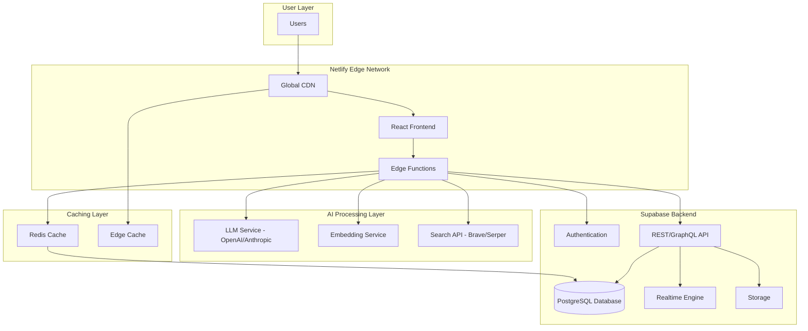
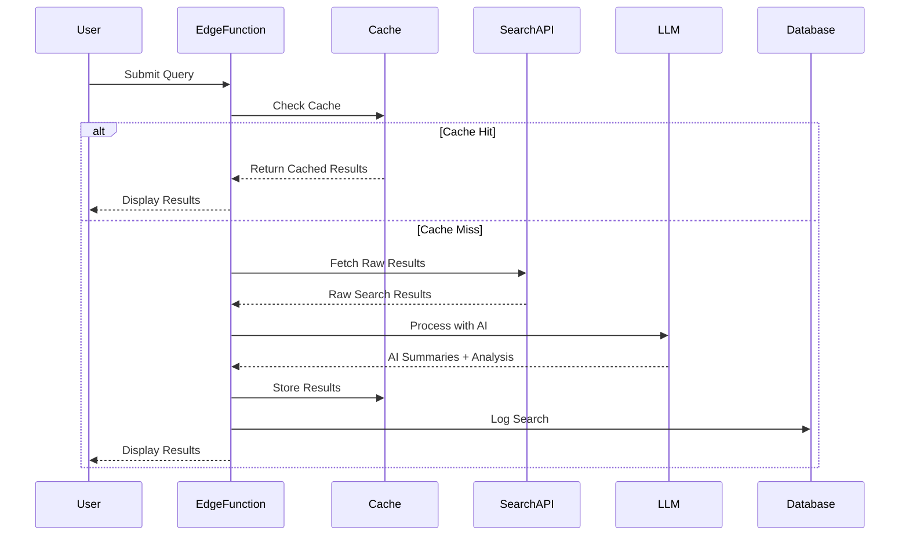
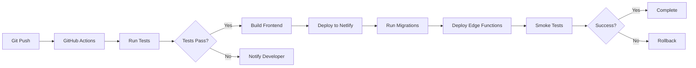

# Spooky AI Search - Design Document

## Overview

Spooky AI Search is a next-generation AI-powered search engine built on a modern, scalable architecture using Netlify for frontend hosting and edge compute, and Supabase for backend services. The system is designed to handle 10,000+ concurrent users with sub-second response times through intelligent caching, edge computing, and distributed processing.

### Key Innovations

1. **Multi-Perspective Analysis Engine** - Automatically identifies and presents different viewpoints on topics
2. **Dynamic Knowledge Graph Generation** - Real-time visualization of concept relationships
3. **Collaborative Search Sessions** - Team-based research with real-time synchronization
4. **AI-Powered Source Verification** - Automated credibility scoring and fact-checking
5. **Multi-Modal Query Processing** - Support for text, voice, image, and code searches

## Architecture

### High-Level Architecture



### Technology Stack

**Frontend:**
- React 18 with TypeScript
- TailwindCSS for styling
- Zustand for state management
- React Query for data fetching and caching
- D3.js for knowledge graph visualization
- Socket.io client for real-time collaboration

**Backend (Netlify):**
- Netlify Edge Functions (Deno runtime)
- Netlify Blobs for temporary file storage
- Netlify Forms for feedback collection

**Backend (Supabase):**
- PostgreSQL with pgvector extension for embeddings
- Supabase Auth for authentication
- Supabase Realtime for collaborative features
- Supabase Storage for user uploads
- Row Level Security (RLS) for data protection

**External Services:**
- OpenAI GPT-4 or Anthropic Claude for AI processing
- Brave Search API or Serper API for web search
- Upstash Redis for distributed caching
- Cloudflare Workers KV (via Netlify) for edge caching

## Components and Interfaces

### 1. Frontend Components

#### SearchInterface Component
```typescript
interface SearchInterfaceProps {
  onSearch: (query: SearchQuery) => Promise<void>;
  isLoading: boolean;
  sessionId?: string;
}

interface SearchQuery {
  text?: string;
  voice?: Blob;
  image?: File;
  code?: string;
  context?: string[];
}
```

**Responsibilities:**
- Capture user input (text, voice, image, code)
- Display search results with AI summaries
- Show loading states and progress indicators
- Handle multi-modal input switching

#### ResultsDisplay Component
```typescript
interface SearchResult {
  id: string;
  title: string;
  url: string;
  snippet: string;
  aiSummary: string;
  credibilityScore: number;
  sourceMetadata: SourceMetadata;
  perspectives?: Perspective[];
}

interface SourceMetadata {
  author?: string;
  publishDate?: Date;
  domain: string;
  factCheckStatus: 'verified' | 'disputed' | 'unverified';
}
```

**Responsibilities:**
- Render search results with credibility indicators
- Display AI-generated summaries
- Show multi-perspective analysis
- Provide source verification details

#### KnowledgeGraph Component
```typescript
interface KnowledgeGraphProps {
  query: string;
  nodes: GraphNode[];
  edges: GraphEdge[];
  onNodeClick: (nodeId: string) => void;
}

interface GraphNode {
  id: string;
  label: string;
  type: 'concept' | 'entity' | 'topic';
  relevance: number;
}
```

**Responsibilities:**
- Visualize concept relationships using D3.js
- Support interactive exploration
- Highlight related concepts on hover
- Enable click-to-search on nodes

#### CollaborationPanel Component
```typescript
interface CollaborationPanelProps {
  sessionId: string;
  participants: Participant[];
  sharedResults: SearchResult[];
  annotations: Annotation[];
}
```

**Responsibilities:**
- Display active participants
- Show real-time search updates
- Manage annotations and comments
- Handle session invitations

### 2. Edge Functions (Netlify)

#### search-handler.ts
```typescript
interface SearchRequest {
  query: SearchQuery;
  userId?: string;
  sessionId?: string;
  preferences?: UserPreferences;
}

interface SearchResponse {
  results: SearchResult[];
  aiSummary: string;
  knowledgeGraph: KnowledgeGraphData;
  followUpQuestions: string[];
  processingTime: number;
}
```

**Responsibilities:**
- Orchestrate search pipeline
- Check cache for existing results
- Call external search APIs
- Process results through AI models
- Generate knowledge graphs
- Return formatted response

#### ai-processor.ts
```typescript
interface AIProcessingRequest {
  query: string;
  searchResults: RawSearchResult[];
  userContext?: UserContext;
}

interface AIProcessingResponse {
  summaries: Map<string, string>;
  perspectives: Perspective[];
  credibilityScores: Map<string, number>;
  knowledgeGraph: KnowledgeGraphData;
  followUpQuestions: string[];
}
```

**Responsibilities:**
- Generate AI summaries for each result
- Extract multiple perspectives
- Calculate credibility scores
- Build knowledge graph data
- Generate follow-up questions

#### realtime-sync.ts
```typescript
interface RealtimeMessage {
  type: 'search' | 'annotation' | 'join' | 'leave';
  sessionId: string;
  userId: string;
  payload: any;
  timestamp: number;
}
```

**Responsibilities:**
- Handle WebSocket connections
- Broadcast search updates to session participants
- Sync annotations in real-time
- Manage participant presence

### 3. Supabase Database Schema

#### users table
```sql
CREATE TABLE users (
  id UUID PRIMARY KEY DEFAULT uuid_generate_v4(),
  email TEXT UNIQUE NOT NULL,
  created_at TIMESTAMPTZ DEFAULT NOW(),
  expertise_level TEXT CHECK (expertise_level IN ('beginner', 'intermediate', 'expert')),
  interest_areas TEXT[],
  preferences JSONB
);
```

#### search_sessions table
```sql
CREATE TABLE search_sessions (
  id UUID PRIMARY KEY DEFAULT uuid_generate_v4(),
  created_by UUID REFERENCES users(id),
  created_at TIMESTAMPTZ DEFAULT NOW(),
  expires_at TIMESTAMPTZ DEFAULT NOW() + INTERVAL '30 days',
  is_shared BOOLEAN DEFAULT false,
  session_name TEXT
);
```

#### search_history table
```sql
CREATE TABLE search_history (
  id UUID PRIMARY KEY DEFAULT uuid_generate_v4(),
  user_id UUID REFERENCES users(id),
  session_id UUID REFERENCES search_sessions(id),
  query TEXT NOT NULL,
  query_embedding VECTOR(1536),
  results JSONB,
  created_at TIMESTAMPTZ DEFAULT NOW()
);

CREATE INDEX ON search_history USING ivfflat (query_embedding vector_cosine_ops);
```

#### annotations table
```sql
CREATE TABLE annotations (
  id UUID PRIMARY KEY DEFAULT uuid_generate_v4(),
  session_id UUID REFERENCES search_sessions(id),
  user_id UUID REFERENCES users(id),
  result_id TEXT NOT NULL,
  content TEXT NOT NULL,
  created_at TIMESTAMPTZ DEFAULT NOW()
);
```

#### cached_results table
```sql
CREATE TABLE cached_results (
  id UUID PRIMARY KEY DEFAULT uuid_generate_v4(),
  query_hash TEXT UNIQUE NOT NULL,
  query_text TEXT NOT NULL,
  results JSONB NOT NULL,
  ai_summary TEXT,
  knowledge_graph JSONB,
  created_at TIMESTAMPTZ DEFAULT NOW(),
  expires_at TIMESTAMPTZ DEFAULT NOW() + INTERVAL '1 hour',
  hit_count INTEGER DEFAULT 0
);

CREATE INDEX ON cached_results (query_hash);
CREATE INDEX ON cached_results (expires_at);
```

#### session_participants table
```sql
CREATE TABLE session_participants (
  session_id UUID REFERENCES search_sessions(id),
  user_id UUID REFERENCES users(id),
  joined_at TIMESTAMPTZ DEFAULT NOW(),
  last_active TIMESTAMPTZ DEFAULT NOW(),
  PRIMARY KEY (session_id, user_id)
);
```

### 4. Caching Strategy

#### Three-Tier Caching System

**Tier 1: Edge Cache (Netlify CDN)**
- Cache static assets (JS, CSS, images)
- Cache common search results at edge locations
- TTL: 5 minutes for search results
- Invalidation: On-demand via API

**Tier 2: Redis Cache (Upstash)**
- Cache processed AI results
- Cache user session data
- Cache knowledge graph data
- TTL: 1 hour for search results, 24 hours for user data
- Key pattern: `search:{query_hash}`, `user:{user_id}`, `session:{session_id}`

**Tier 3: Database Cache (Supabase)**
- Persistent cache for popular queries
- Historical search data for personalization
- TTL: Managed by cleanup job (remove entries older than 24 hours)

### 5. AI Processing Pipeline



#### AI Processing Steps

1. **Query Understanding**
   - Extract intent and entities
   - Identify query type (factual, opinion, comparison, etc.)
   - Generate query embeddings for semantic search

2. **Multi-Source Search**
   - Query Brave/Serper API for web results
   - Search internal knowledge base (if applicable)
   - Parallel execution for speed

3. **Result Processing**
   - Generate AI summaries for each result (batch processing)
   - Extract key facts and claims
   - Identify perspectives and viewpoints

4. **Credibility Scoring**
   - Analyze source domain authority
   - Check publication date recency
   - Cross-reference with fact-checking databases
   - Calculate composite credibility score (0-100)

5. **Knowledge Graph Generation**
   - Extract entities and concepts from results
   - Identify relationships between concepts
   - Build graph structure with relevance weights

6. **Follow-Up Generation**
   - Analyze query context
   - Generate 3-5 relevant follow-up questions
   - Rank by potential user interest

## Data Models

### Core Data Models

#### SearchQuery Model
```typescript
interface SearchQuery {
  id: string;
  userId?: string;
  sessionId?: string;
  queryText: string;
  queryType: 'text' | 'voice' | 'image' | 'code';
  queryEmbedding?: number[];
  context: string[];
  timestamp: Date;
  preferences?: UserPreferences;
}
```

#### SearchResult Model
```typescript
interface SearchResult {
  id: string;
  queryId: string;
  title: string;
  url: string;
  snippet: string;
  aiSummary: string;
  credibilityScore: number;
  sourceMetadata: SourceMetadata;
  perspectives: Perspective[];
  rank: number;
  processingTime: number;
}

interface Perspective {
  viewpoint: string;
  summary: string;
  supportingEvidence: string[];
  prevalence: 'majority' | 'minority' | 'emerging';
}
```

#### KnowledgeGraph Model
```typescript
interface KnowledgeGraphData {
  nodes: GraphNode[];
  edges: GraphEdge[];
  centerNode: string;
  generatedAt: Date;
}

interface GraphNode {
  id: string;
  label: string;
  type: 'concept' | 'entity' | 'topic' | 'person' | 'organization';
  relevance: number;
  description?: string;
}

interface GraphEdge {
  source: string;
  target: string;
  relationship: string;
  strength: number;
}
```

#### UserPreferences Model
```typescript
interface UserPreferences {
  expertiseLevel: 'beginner' | 'intermediate' | 'expert';
  interestAreas: string[];
  preferredSources: string[];
  excludedSources: string[];
  resultDensity: 'concise' | 'balanced' | 'detailed';
  enablePersonalization: boolean;
  anonymousMode: boolean;
}
```

## Error Handling

### Error Categories

1. **User Input Errors (4xx)**
   - Invalid query format
   - Query too long
   - Rate limit exceeded
   - Authentication required

2. **System Errors (5xx)**
   - External API failures
   - Database connection errors
   - AI processing timeouts
   - Cache unavailable

3. **Performance Errors**
   - Query timeout (>5 seconds)
   - Resource exhaustion
   - Concurrent user limit reached

### Error Handling Strategy

```typescript
interface ErrorResponse {
  error: {
    code: string;
    message: string;
    details?: any;
    retryable: boolean;
    retryAfter?: number;
  };
  fallback?: Partial<SearchResponse>;
}
```

**Graceful Degradation:**
- If AI processing fails, return raw search results
- If knowledge graph generation fails, omit from response
- If cache is unavailable, proceed without caching
- If external search API fails, try backup API

**Retry Logic:**
- Exponential backoff for transient failures
- Maximum 3 retry attempts
- Circuit breaker pattern for external services
- Fallback to cached results when available

**User Communication:**
- Clear error messages without technical jargon
- Suggest alternative actions
- Show partial results when possible
- Provide status updates for long-running operations

## Testing Strategy

### Unit Testing

**Frontend Components:**
- Test each component in isolation
- Mock API calls and external dependencies
- Test user interactions and state changes
- Verify accessibility compliance

**Edge Functions:**
- Test request/response handling
- Mock external API calls
- Test caching logic
- Verify error handling

**Utilities:**
- Test data transformation functions
- Test validation logic
- Test embedding generation
- Test credibility scoring algorithms

### Integration Testing

**API Integration:**
- Test Supabase client operations
- Test external search API integration
- Test LLM API integration
- Test real-time synchronization

**End-to-End Flows:**
- Test complete search flow
- Test collaborative session creation and joining
- Test multi-modal search inputs
- Test result caching and retrieval

### Performance Testing

**Load Testing:**
- Simulate 10,000 concurrent users
- Measure response times under load
- Test auto-scaling behavior
- Identify bottlenecks

**Stress Testing:**
- Test system limits
- Measure recovery from failures
- Test database connection pooling
- Test cache performance under pressure

### Security Testing

**Authentication:**
- Test JWT token validation
- Test session management
- Test rate limiting
- Test API key protection

**Data Protection:**
- Test RLS policies in Supabase
- Test data encryption
- Test anonymous mode
- Test data deletion

## Performance Optimization

### Frontend Optimization

1. **Code Splitting**
   - Lazy load components
   - Split by route
   - Dynamic imports for heavy libraries (D3.js)

2. **Asset Optimization**
   - Image compression and lazy loading
   - Font subsetting
   - CSS purging with TailwindCSS

3. **State Management**
   - Minimize re-renders
   - Use React.memo for expensive components
   - Implement virtual scrolling for large result lists

### Backend Optimization

1. **Query Optimization**
   - Use database indexes effectively
   - Implement query result pagination
   - Use connection pooling (Supavisor)

2. **Caching Strategy**
   - Cache at multiple levels
   - Implement cache warming for popular queries
   - Use stale-while-revalidate pattern

3. **Parallel Processing**
   - Process AI summaries in parallel
   - Fetch from multiple search APIs concurrently
   - Use Promise.all for independent operations

### Scalability Measures

1. **Horizontal Scaling**
   - Netlify Edge Functions auto-scale globally
   - Supabase connection pooling handles concurrent connections
   - Redis cluster for distributed caching

2. **Database Optimization**
   - Use read replicas for query-heavy operations
   - Implement database partitioning for large tables
   - Regular vacuum and analyze operations

3. **Rate Limiting**
   - Per-user rate limits (100 queries/minute)
   - Per-IP rate limits for anonymous users
   - Graceful degradation when limits approached

## Deployment Strategy

### CI/CD Pipeline



### Environment Configuration

**Development:**
- Local Supabase instance
- Mock external APIs
- Debug logging enabled

**Staging:**
- Supabase staging project
- Real external APIs with test keys
- Performance monitoring enabled

**Production:**
- Supabase production project
- Production API keys
- Full monitoring and alerting
- Auto-scaling enabled

### Monitoring and Observability

**Metrics to Track:**
- Query response times (p50, p95, p99)
- Cache hit rates
- Error rates by type
- Concurrent user count
- Database connection pool usage
- External API latency

**Alerting:**
- Response time > 3 seconds
- Error rate > 1%
- Concurrent users > 9,000
- Database connections > 80% capacity
- Cache unavailable

**Logging:**
- Structured JSON logs
- Request/response logging
- Error stack traces
- Performance traces

## Security Considerations

### Authentication & Authorization

- Supabase Auth with JWT tokens
- Row Level Security (RLS) for all tables
- API key rotation for external services
- Secure session management

### Data Protection

- TLS 1.3 for all connections
- AES-256 encryption at rest
- Encrypted database backups
- Secure environment variable management

### Privacy

- Anonymous search mode (no logging)
- GDPR-compliant data deletion
- User data export functionality
- Clear privacy policy and consent

### Rate Limiting & Abuse Prevention

- Per-user and per-IP rate limits
- CAPTCHA for suspicious activity
- API key validation
- Request signature verification

## Future Enhancements

1. **Advanced AI Features**
   - Custom AI models fine-tuned on search data
   - Multi-language support
   - Voice response generation

2. **Enhanced Collaboration**
   - Video/audio chat in shared sessions
   - Collaborative note-taking
   - Export to various formats

3. **Mobile Applications**
   - Native iOS and Android apps
   - Offline search capability
   - Push notifications for shared sessions

4. **Enterprise Features**
   - Team workspaces
   - Admin dashboards
   - Usage analytics
   - Custom branding
